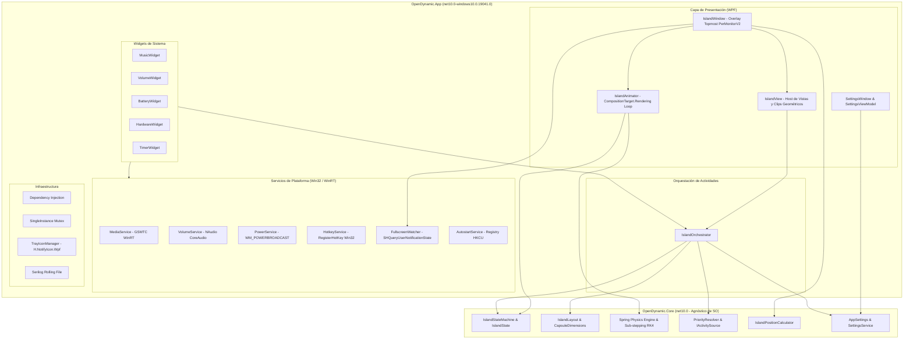
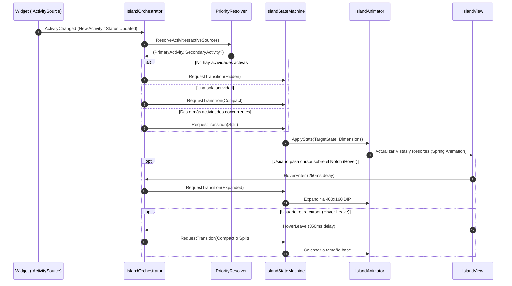
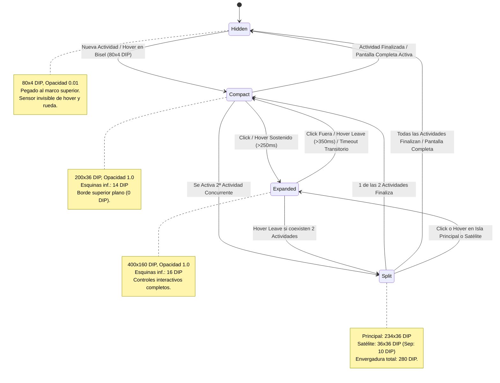

# Arquitectura Técnica de openDynamic

> **openDynamic** es una implementación de Dynamic Island / Notch superior para Windows 10/11 construida sobre .NET 10 y WPF, diseñada con enfoque de alto rendimiento, animaciones fluidas basadas en física de resortes y consumo mínimo de recursos (< 30 MB RAM, 0.0% CPU en reposo).

---

## 1. Diagrama Conceptual de Capas (Core vs. App)

La arquitectura de openDynamic sigue un principio estricto de separación entre el motor lógico-matemático agnóstico del sistema operativo (`OpenDynamic.Core`) y el host nativo de Windows / WPF (`OpenDynamic.App`).



### Características de las Capas:

1. **`OpenDynamic.Core` (net10.0):**
   - **Cero dependencias de Windows:** No referencia WPF, Win32, WinRT ni COM. Compila y ejecuta en cualquier entorno .NET 10.
   - **Motor de física (`Spring.cs`):** Resuelve ecuaciones diferenciales de segundo orden con amortiguación crítica o elástica mediante integración numérica por sub-stepping.
   - **Máquina de Estados (`IslandStateMachine.cs`):** Valida y gestiona las transiciones entre estados válidos (`Hidden`, `Compact`, `Expanded`, `Split`).
   - **Resolvedor de Prioridades (`PriorityResolver.cs`):** Algoritmo determinista que ordena actividades en competencia.
   - **Persistencia (`SettingsService.cs`):** Serialización atómica JSON con control de versiones de esquema y migraciones automáticas.

2. **`OpenDynamic.App` (net10.0-windows10.0.19041.0):**
   - **Ventana Overlay (`IslandWindow.xaml`):** Ventana sin marco (`WS_EX_TOOLWINDOW | WS_EX_NOACTIVATE | WS_EX_LAYERED`), con click-through selectivo por píxel en áreas transparentes (`WS_EX_TRANSPARENT` dinámico) y soporte PerMonitorV2.
   - **Loop de renderizado reactivo (`IslandAnimator.cs`):** Se suscribe a `CompositionTarget.Rendering` exclusivamente durante el movimiento de los resortes; se desuscribe de inmediato al asentarse la animación para garantizar 0.0% CPU en reposo.
   - **Servicios reactivos:** Sin hilos en bucles infinitos (`while(true)`) ni hooks globales de bajo nivel (`WH_MOUSE_LL`, `WH_KEYBOARD_LL`).

---

## 2. Flujo del IslandOrchestrator

El `IslandOrchestrator` es el componente central de coordinación. Es el único componente con autoridad para solicitar cambios de estado a la máquina de estados y decidir qué widget se muestra en la cápsula principal y cuál en la burbuja satélite (Split).



### Tabla de Prioridades de Actividades:

| Prioridad | Widget | Tipo de Actividad | Comportamiento |
|---|---|---|---|
| **5 (Máxima)** | `HardwareWidget` | Estado de Hardware (CPU/RAM) | Si el usuario lo activa en Ajustes, toma el foco principal mientras esté activo. |
| **4** | `VolumeWidget` | Control de Volumen | Transitorio (2.5 segundos tras último cambio de volumen por rueda o teclas multimedia). |
| **4** | `BatteryWidget` | Alerta de Batería Crítica / Conexión | Transitorio (5 segundos al conectar/desconectar o caer a < 20%). |
| **3** | `TimerWidget` | Temporizador en Cuenta Regresiva | Continuo mientras corre el temporizador; entra en alarma palpitante al expirar. |
| **2** | `MusicWidget` | Reproducción Multimedia (GSMTC) | Continuo mientras el estado sea `Playing`. Se retira si se pausa por más de 10s. |
| **1 (Mínima)** | `DemoWidget` / Extensiones | Actividades informativas secundarias | Visible si ninguna actividad de mayor prioridad la opaca. |

---

## 3. Ciclo de Vida de los Estados (FSM)

La máquina de estados finita (`IslandStateMachine`) controla de forma determinista la forma, el tamaño y la interactividad del notch superior:



---

## 4. Guía de 10 Pasos para Crear e Integrar un Nuevo Widget

Esta guía describe el procedimiento exacto y paso a paso para que cualquier desarrollador externo implemente un nuevo widget (por ejemplo, `WeatherWidget`) e integrarlo en openDynamic sin modificar el núcleo de animación.

### Paso 1: Definir el Alcance y el Tipo de Actividad
Determina el propósito del widget, si su actividad es continua o transitoria, y su nivel de prioridad en `ActivityType`.
- **Ejemplo:** Widget de Clima (`WeatherWidget`). Muestra temperatura y condición en modo compacto, pronóstico extendido en modo expandido. Prioridad informativa (nivel 1 o 2).

### Paso 2: Crear el Modelo de Estado del Widget
Crea la clase inmutable de estado que encapsula los datos a presentar en `src/OpenDynamic.App/Widgets/Weather/Models/WeatherState.cs`:

```csharp
namespace OpenDynamic.App.Widgets.Weather.Models;

public record WeatherState(
    double TemperatureCelsius,
    string ConditionText,
    string WeatherIconKey,
    string CityName,
    double HumidityPercent,
    double WindSpeedKmH
);
```

### Paso 3: Crear el Servicio de Datos en Segundo Plano
Implementa el servicio que consulta la información de manera asíncrona y con consumo de red inteligente en `Services/WeatherService.cs`:

```csharp
namespace OpenDynamic.App.Widgets.Weather.Services;

public interface IWeatherService
{
    WeatherState? CurrentWeather { get; }
    event EventHandler? WeatherUpdated;
}

public class WeatherService : IWeatherService, IDisposable
{
    private readonly PeriodicTimer _timer = new(TimeSpan.FromMinutes(15));
    public WeatherState? CurrentWeather { get; private set; }
    public event EventHandler? WeatherUpdated;

    public WeatherService()
    {
        _ = RefreshLoopAsync();
    }

    private async Task RefreshLoopAsync()
    {
        while (await _timer.WaitForNextTickAsync())
        {
            // Consultar datos de clima sin bloquear la UI
            CurrentWeather = new WeatherState(21.5, "Soleado", "SunIcon", "Madrid", 45, 12);
            WeatherUpdated?.Invoke(this, EventArgs.Empty);
        }
    }

    public void Dispose() => _timer.Dispose();
}
```

### Paso 4: Implementar la Clase del Widget (`IWidget` e `IActivitySource`)
Crea `WeatherWidget.cs` implementando los contratos de la arquitectura:

```csharp
using OpenDynamic.Core.Widgets;
using OpenDynamic.App.Widgets.Weather.Services;

namespace OpenDynamic.App.Widgets.Weather;

public class WeatherWidget : IWidget, IActivitySource, IDisposable
{
    private readonly IWeatherService _weatherService;
    public string WidgetId => "widget.weather";
    public string DisplayName => "Clima";
    public int Priority => 1; // Prioridad base informativa

    public event EventHandler<ActivityChangedEventArgs>? ActivityChanged;

    public WeatherWidget(IWeatherService weatherService)
    {
        _weatherService = weatherService;
        _weatherService.WeatherUpdated += OnWeatherUpdated;
    }

    private void OnWeatherUpdated(object? sender, EventArgs e)
    {
        bool hasData = _weatherService.CurrentWeather != null;
        ActivityChanged?.Invoke(this, new ActivityChangedEventArgs(
            WidgetId,
            isActive: hasData,
            priority: Priority,
            data: _weatherService.CurrentWeather
        ));
    }

    public void Dispose()
    {
        _weatherService.WeatherUpdated -= OnWeatherUpdated;
    }
}
```

### Paso 5: Notificar Actividad al `IslandOrchestrator`
Asegúrate de que `ActivityChanged` emita un evento con `isActive: true` cuando haya información disponible y `isActive: false` si el widget entra en reposo. El `IslandOrchestrator` escuchará este evento automáticamente tras el registro.

### Paso 6: Diseñar la Vista Compacta en XAML (`WeatherCompactView.xaml`)
Crea `Widgets/Weather/Views/WeatherCompactView.xaml` con controles ligeros pensados para una altura de 36 DIP:

```xml
<UserControl x:Class="OpenDynamic.App.Widgets.Weather.Views.WeatherCompactView"
             xmlns="http://schemas.microsoft.com/winfx/2006/xaml/presentation"
             xmlns:x="http://schemas.microsoft.com/winfx/2006/xaml">
    <StackPanel Orientation="Horizontal" VerticalAlignment="Center" Margin="10,0">
        <!-- Icono Clima -->
        <Path Data="M12,2A10,10 0 1,0 22,12A10,10 0 0,0 12,2Z" Fill="#F59E0B" Width="14" Height="14" Stretch="Uniform"/>
        <!-- Temperatura -->
        <TextBlock Text="{Binding TemperatureCelsius, StringFormat='{}{0:F0}°C'}" 
                   Foreground="White" FontWeight="SemiBold" FontSize="12" Margin="6,0,0,0"/>
    </StackPanel>
</UserControl>
```

### Paso 7: Diseñar la Vista Expandida en XAML (`WeatherExpandedView.xaml`)
Crea `Widgets/Weather/Views/WeatherExpandedView.xaml` para el modo expandido (hasta 400x160 DIP):

```xml
<UserControl x:Class="OpenDynamic.App.Widgets.Weather.Views.WeatherExpandedView"
             xmlns="http://schemas.microsoft.com/winfx/2006/xaml/presentation"
             xmlns:x="http://schemas.microsoft.com/winfx/2006/xaml">
    <Grid Margin="20">
        <Grid.ColumnDefinitions>
            <ColumnDefinition Width="Auto"/>
            <ColumnDefinition Width="*"/>
        </Grid.ColumnDefinitions>
        
        <StackPanel Grid.Column="0" VerticalAlignment="Center">
            <TextBlock Text="{Binding CityName}" Foreground="#94A3B8" FontSize="13"/>
            <TextBlock Text="{Binding TemperatureCelsius, StringFormat='{}{0:F1}°C'}" 
                       Foreground="White" FontSize="32" FontWeight="Bold"/>
            <TextBlock Text="{Binding ConditionText}" Foreground="#38BDF8" FontSize="14"/>
        </StackPanel>

        <StackPanel Grid.Column="1" HorizontalAlignment="Right" VerticalAlignment="Center">
            <TextBlock Text="{Binding HumidityPercent, StringFormat='Humedad: {0}%'}" Foreground="#E2E8F0" FontSize="12"/>
            <TextBlock Text="{Binding WindSpeedKmH, StringFormat='Viento: {0} km/h'}" Foreground="#E2E8F0" FontSize="12" Margin="0,4,0,0"/>
        </StackPanel>
    </Grid>
</UserControl>
```

### Paso 8: Registrar los `DataTemplate` en `IslandView.xaml`
En `Views/IslandView.xaml`, mapea el modelo `WeatherState` a las vistas compactas y expandidas:

```xml
<DataTemplate DataType="{x:Type weatherModels:WeatherState}">
    <!-- Selector o vista correspondiente según el estado de la cápsula -->
    <weatherViews:WeatherCompactView />
</DataTemplate>
```

### Paso 9: Registrar el Servicio y Widget en el Contenedor DI
En `App.xaml.cs` (o `Program.cs`), añade las dependencias:

```csharp
// Registro en ConfigureServices
services.AddSingleton<IWeatherService, WeatherService>();
services.AddSingleton<WeatherWidget>();

// Al inicializar el MainWindow / IslandOrchestrator:
var orchestrator = serviceProvider.GetRequiredService<IslandOrchestrator>();
orchestrator.RegisterActivitySource(serviceProvider.GetRequiredService<WeatherWidget>());
```

### Paso 10: Escribir Pruebas Unitarias en `OpenDynamic.Tests`
En el proyecto de pruebas `tests/OpenDynamic.Tests/Widgets/WeatherWidgetTests.cs`, valida la lógica de negocio y emisión de actividades:

```csharp
[Fact]
public void WeatherWidget_EmitsActivity_WhenDataIsLoaded()
{
    var mockService = new MockWeatherService();
    using var widget = new WeatherWidget(mockService);
    
    ActivityChangedEventArgs? capturedEvent = null;
    widget.ActivityChanged += (s, e) => capturedEvent = e;

    mockService.TriggerUpdate(new WeatherState(25, "Despejado", "Sun", "Madrid", 40, 10));

    Assert.NotNull(capturedEvent);
    Assert.True(capturedEvent.IsActive);
    Assert.Equal("widget.weather", capturedEvent.WidgetId);
}
```

---

## 5. Garantías de Rendimiento y Reglas de Oro

1. **CPU 0.0% en Reposo:**
   - La aplicación nunca usa timers en bucle para refrescar la UI visual si no hay cambios.
   - `IslandAnimator` se conecta a `CompositionTarget.Rendering` únicamente mientras `_spring.IsSettled == false`.
2. **Cero Hooks Globales de Bajo Nivel:**
   - Los atajos se registran con `RegisterHotKey` Win32 vinculado al `WndProc`.
   - La rueda del ratón y el hover se capturan por eventos normales de WPF sobre la geometría activa del notch.
3. **Cero Privilegios UAC:**
   - La aplicación corre en espacio de usuario estándar. Las configuraciones residen en `%AppData%\openDynamic\settings.json` y el inicio automático en `HKCU\Software\Microsoft\Windows\CurrentVersion\Run`.
4. **Click-Through por Píxel:**
   - La ventana overlay tiene tamaño 640x240 DIP con fondo transparente. Los clics sobre áreas transparentes atraviesan inmediatamente a las ventanas que estén detrás gracias a la conmutación dinámica de estilos extendidos Win32.
